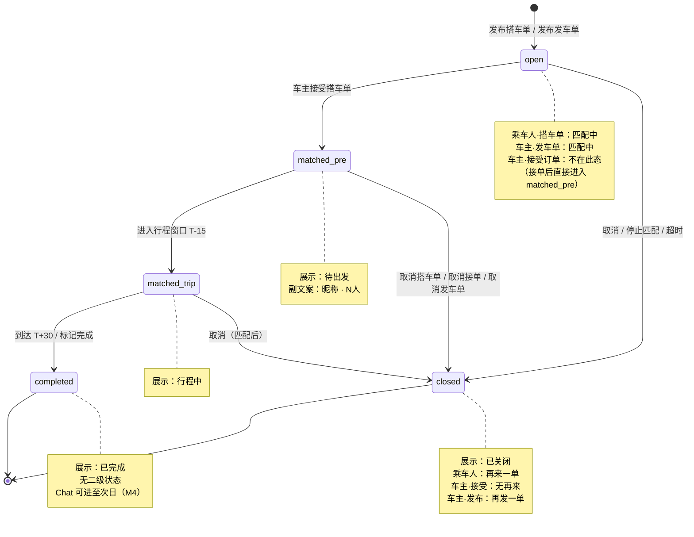
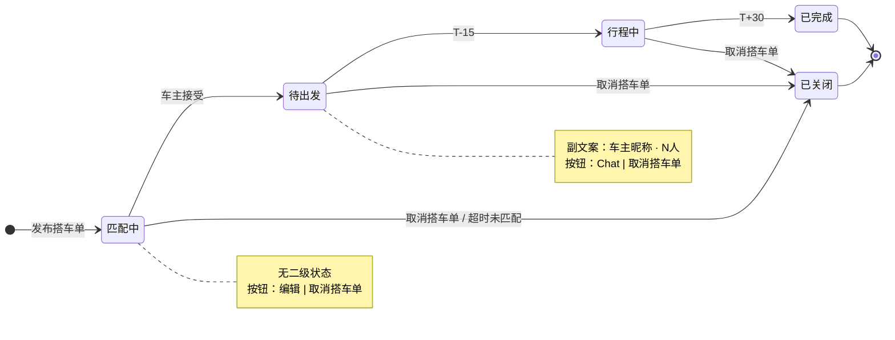
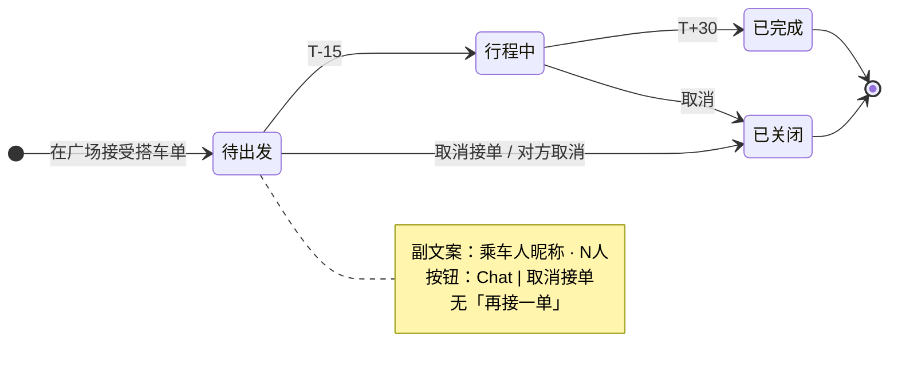
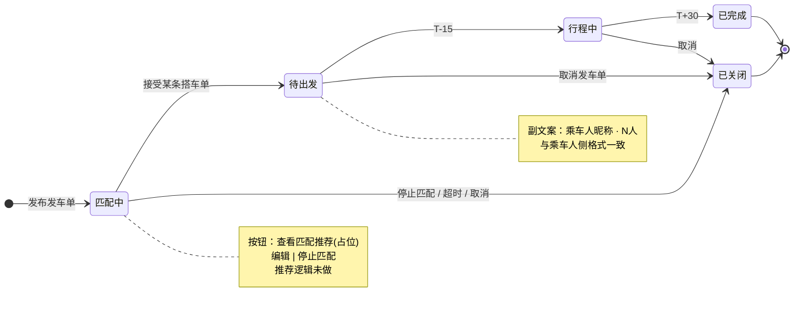
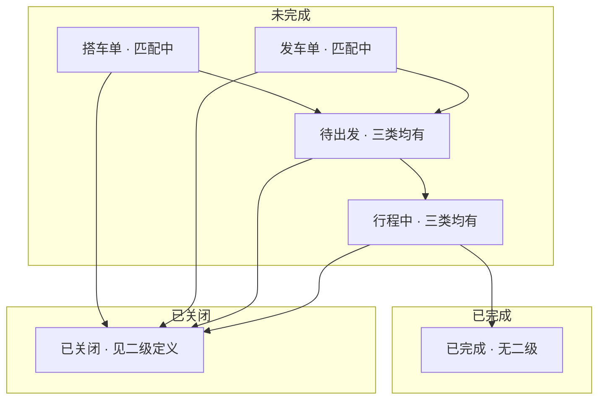
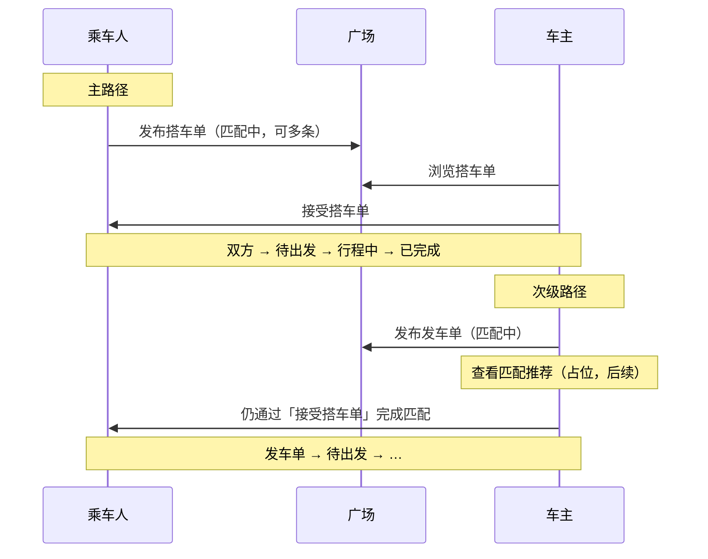

# M1 订单状态机图

> 配套 [`M1_ORDER_STATES.md`](./M1_ORDER_STATES.md)、[`ORDER_INTEGRATION_GUIDE.md`](./ORDER_INTEGRATION_GUIDE.md)。底层 5 态；**展示名**因订单类型而异。

---

## 1. 统一底层状态机（所有订单类型）

---

## 2. 乘车人 · 搭车单（可多条并行）

---

## 3. 车主 · 接受订单（原「我接的搭车单」）

---

## 4. 车主 · 发车单（发布行程 · 匹配推荐后续）

---

## 5. 三类型在同一 Filter 下的归类

---

## 6. 匹配完成路径（业务流）

