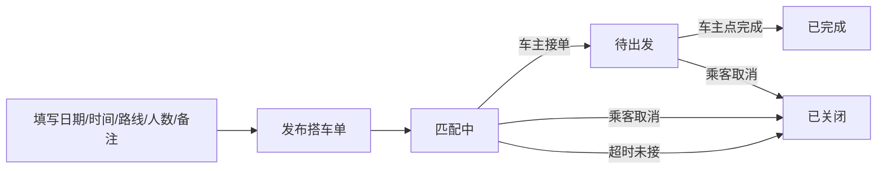
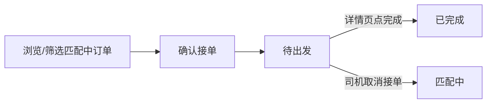

# M3 Mock 演示流程说明（产品经理版）

【读者】产品经理、业务 / 体验负责人、全体组员  
【不适合】直接给 Agent 写接口（请用 M3_INTEGRATION_STATUS.md + ORDER_INTEGRATION_GUIDE.md）  
【何时阅读】了解本 PR 在开发者工具里能演示什么、状态如何变化  

> 长期状态定义仍以 [`ORDER_FLOWS_PM.md`](./ORDER_FLOWS_PM.md) 为准。  
> 本文描述 **PR #2 主路径 + PR #3 增量** 合并后的 Mock 可演示范围；部分路径做了简化（见第五节）。

**PR：** [#3](https://github.com/arsray/ddcarpool/pull/3) · `feat/m3-driver-plaza` → `main`  
**仓库：** https://github.com/arsray/ddcarpool  
**前置：** PR #2（发单 / 接单 / 完成主路径）已合并或可联调

---

## 一、本 PR 覆盖的五种状态（英文存储码）

| 底层码 | UI 中文 | 本 PR 是否可演示 |
|--------|---------|------------------|
| `matching` | 匹配中 | ✅ 发单后、被接单前；**司机取消接单后回此状态** |
| `pending_departure` | 待出发 | ✅ 车主接单后 |
| `in_progress` | 行程中 | ⚠️ 状态机支持，UI 未单独做「出发」按钮 |
| `completed` | 已完成 | ✅ 车主在详情页点「完成」 |
| `closed` | 已关闭 | ✅ 乘客取消；⚠️ 超时未接自动关闭（系统） |

---

## 二、乘车人 · 发单（Alice）

**入口：** 底部 Tab「发布」

**要点：**

- 仅 **乘车人身份** 可发布；纯车主需先添加乘车人身份  
- 发单成功后进入 **匹配中**，司机可在广场看到（自己发的单不会出现在自己的广场列表）  
- 被接单后，乘客在 **通知中心** 收到通知（含日期、时间窗、路线）；**仅显示与当前账号相关的通知**  
- **匹配中 / 待出发** 可在 **订单详情** 或 **我的订单 → 详情** 取消，二次确认后 → **已关闭**  
- **行程中** 暂不可取消  

**Mock 账号：** Alice · `alice.passenger@disney.com`

---

## 三、车主 · 广场接单（Bob）

**入口：** 底部 Tab「广场」

**页面结构（自上而下）：**

1. 标题区「广场」+ 待办提示（有已接单时）  
2. **已接单 · 待出发**（可点进详情）  
3. **筛选条件**（日期含星期、时间、出发、到达）  
4. **匹配中** 订单列表  

**筛选行为（PR #3）：**

| 场景 | 行为 |
|------|------|
| 首次进入 | 默认 **今天** + **下一个可用 15 分钟时段** |
| 有筛选条件 | 列表分 **「符合条件」** / **「其他匹配中」** 两区 |
| 点 **清除** | 四项恢复 **「全部」**，展示全部匹配中订单 |
| 无筛选（全部） | 按出发时间等规则排序展示全部（见集成状态文档 §4.1） |

**要点：**

- 接单后，该单从「匹配中」列表 **消失**，出现在顶部「已接单」  
- **同一订单不可重复接单**  
- 本 PR 简化：**无「出发」步骤**，送达后在详情页直接点 **「完成」**  
- **待出发** 时司机可 **取消接单** → 订单回 **匹配中**，重新出现在广场  
- 可同时接多单，已接单按出发时间排序  
- POI 已扩展至 **15 点**（含迪心楼、比斯特、羽托邦）  

**Mock 账号：** Bob · `bob.driver@disney.com`

---

## 四、取消订单（PR #3 新增）

**入口：** 订单详情页（广场已接单详情 / 我的订单 → 详情）

| 角色 | 当前状态 | 操作 | 结果 |
|------|----------|------|------|
| 乘客 | 匹配中 / 待出发 | 取消搭车单（二次确认） | → **已关闭** |
| 司机 | 待出发 | 取消接单（二次确认） | → **匹配中**（回广场） |
| 任一方 | 行程中 | — | **不可取消**（未实现） |

- 从广场进入的已接单详情，取消后返回广场 Tab  
- 弹窗文案与权限判定见 `cancel-flow.js`（详情页共用）

---

## 五、与完整产品规划的差异（本 PR 故意简化）

| 规划（ORDER_FLOWS_PM） | 本 PR Mock |
|------------------------|------------|
| 待出发 → 行程中 → 已完成 | 待出发 → **直接** 已完成 |
| 乘车人/车主可取消 | ✅ 匹配中/待出发可取消（详情页二次确认）；❌ 行程中不可取消 |
| 云数据库持久化 | 本地 Storage + 种子单 |
| 车主「发布行程再匹配」 | 未做 |
| M4 行程中 Chat | 未做 |

---

## 六、分工与下一步（简要）

| 模块 | 本 PR 相关 | 下一步 |
|------|------------|--------|
| **M3** | 发单/接单/完成/取消 Mock；筛选与 POI | 云库、`startTrip`、是否恢复「出发」步骤 |
| **M2** | 广场 UI、TabBar、筛选交互 | Review 视觉与组件规范（**请 Shanny 看 PR #3 筛选区**） |
| **M1** | Mock 账号、通知过滤、历史列表桥接 | 五态数据与「我的订单」完全对齐（**请 Crystal 看通知过滤**） |
| **M4** | — | `pending_departure` / `in_progress` 后接入 Chat |

---

## 七、建议验收路径（约 8 分钟）

1. Bob 登录 → 广场 → 改筛选条件 / 点清除 → 接单  
2. 确认：匹配列表无该单；顶部出现已接单卡片  
3. 切 Alice → 通知中心 → 看到接单通知（且无他人通知）  
4. **Alice** → 待出发详情 → 取消 → 状态 **已关闭**（或 **Bob** 取消接单 → 单回广场 **匹配中**）  
5. 重新走一单：Bob → 已接单详情 → 「完成」  
6. Alice → 发布 → 选 POI（15 点）→ 发布成功  

---

**本地预览：** 微信开发者工具导入 **项目根目录** → **我的 → 账号与安全 → Mock 测试账号**
