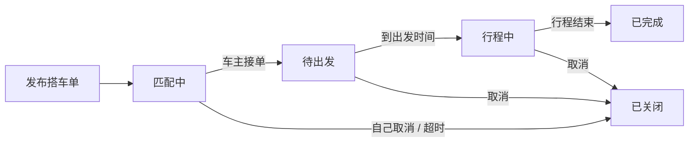
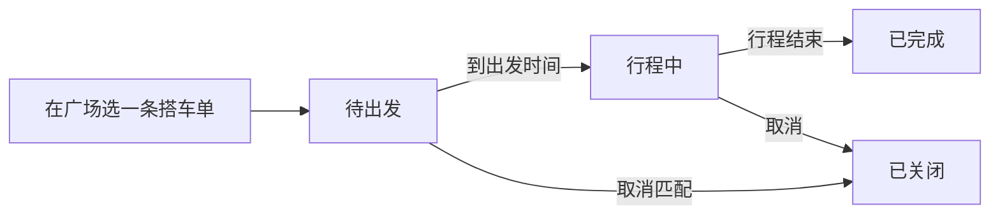
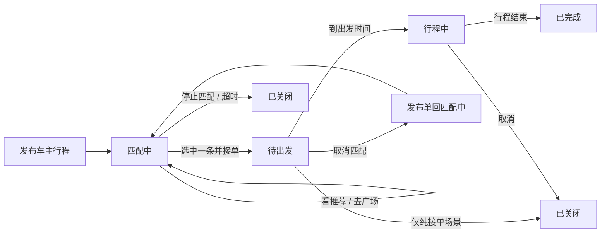
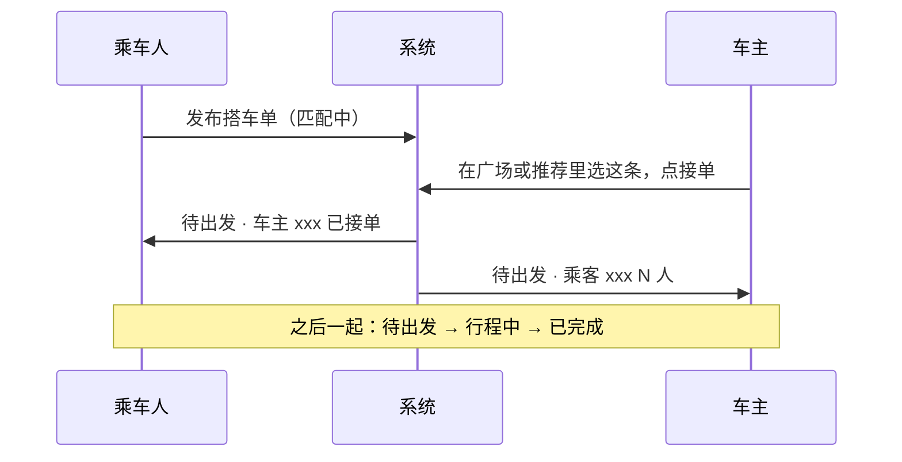

# 订单状态流转图（产品经理版）

【读者】产品经理、业务 / 体验负责人  
【不适合】直接给 Agent 写代码（请用 ORDER_INTEGRATION_GUIDE.md）  
【何时阅读】对齐状态叫什么、怎么流转、取消/停止匹配后去哪一态  

> 配套 [`ORDER_INTEGRATION_GUIDE.md`](./ORDER_INTEGRATION_GUIDE.md)（集成与字段，偏 Agent / 开发）。  
> 在线查看：https://github.com/arsray/ddcarpool/blob/feat/m1-profile/docs/ORDER_FLOWS_PM.md

---

## 一、五种订单状态（两种身份通用）

| 状态 | 用户理解 |
|------|----------|
| **匹配中** | 还在等人接 / 还在等匹配 |
| **待出发** | 已经配上，还没出发 |
| **行程中** | 已在路上 |
| **已完成** | 正常结束 |
| **已关闭** | 取消、停止匹配、超时等 |

---

## 二、乘车人 · 搭车单

**谁能做：** 乘车人 **只能发布** 搭车单，**不能接单**。

**要点：**

- 可以同时有多条「匹配中」搭车单  
- **必须等车主主动接单**，不会自动配上  
- 配上后：乘车人看到「车主 xxx 已接单」

---

## 三、车主 · 两种发单方式

车主有两个入口，**合并显示在「车主订单」里**，用角标区分：

| 角标 | 含义 |
|------|------|
| **接单** | 在广场看到搭车单，主动接的（主流程） |
| **发布** | 自己先发一条行程，等系统推荐后再选接哪单 |

---

### 3.1 车主 · 接单（广场主动接）

**特点：接完直接进入「待出发」，没有「匹配中」。**

**要点：**

- 和乘车人那条搭车单 **成对出现**  
- 取消后：乘车人搭车单回到「匹配中」

---

### 3.2 车主 · 发布（先发行程，再选接哪单）

**特点：发完先「匹配中」，接单后才「待出发」。**

**要点：**

- 发布 **不会自动匹配**，只是「锚点 + 推荐用」  
- **取消匹配**（待出发时）：和对方的配对解除；**发布单回到匹配中**（不是整单关闭）  
- **停止匹配**（还在匹配中时）：整条发布单 **已关闭**

---

## 四、一次匹配 = 两个人各看各的订单

---

## 五、和 M1 占位的关系（简表）

占位清单、每个入口 M1 做到哪、M2/M3/M4 各做什么 → 见 **ORDER_INTEGRATION_GUIDE.md 第 4、5、11、12 节**（邮件正文不再重复）。

| 状态变化谁来实现 | 负责 |
|------------------|------|
| 列表里状态会变、取消/接单生效 | **M3** |
| 匹配成功后能聊天 | **M4** |
| 页面长什么样、按钮/弹窗文案 | **M1 已做好** |

---

## 六、Filter 怎么归类（我的订单里四档筛选）

| 筛选 | 包含哪些状态 |
|------|--------------|
| 未完成 | 匹配中 + 待出发 + 行程中 |
| 已完成 | 已完成 |
| 已关闭 | 已关闭 |

---

**变更记录：** 2026-08-14 初版（PM 可读流转图）
